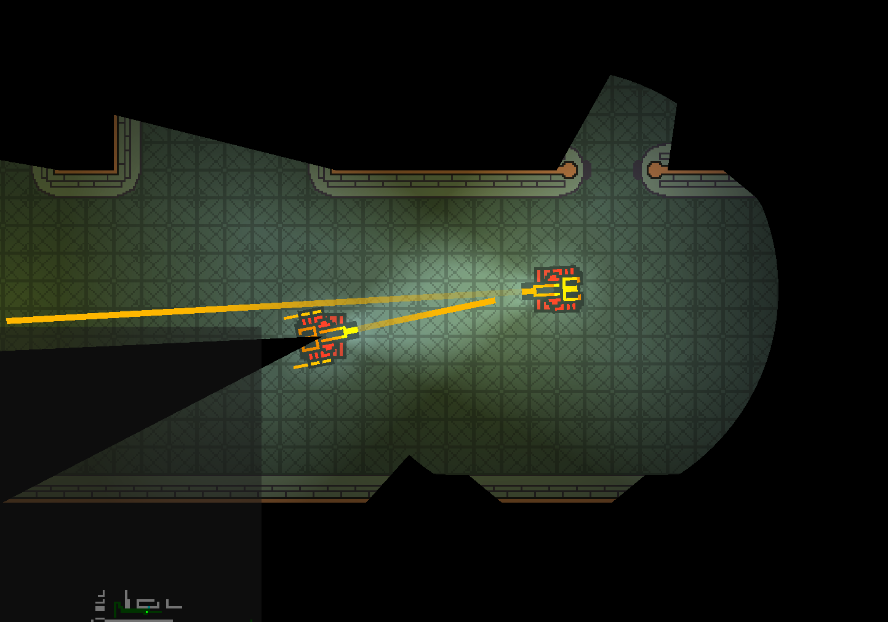
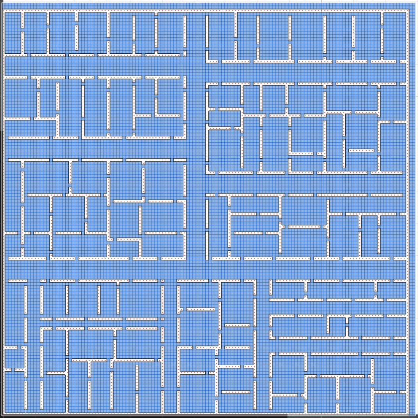

# E268
My Unity 2D SciFi Top-Down Shooter hobby project.

Procedurally generated maps, hand-made pixel sprites and animations, pathfinding AI, dynamically updating minimap, and more...  
Here's an example of a generated map - the algorithm is found in Map.cs and MapRoom.cs:

